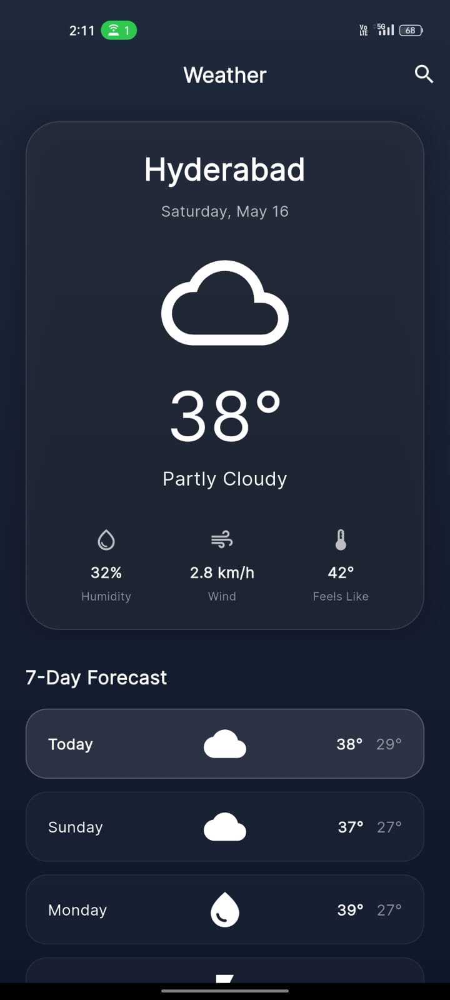
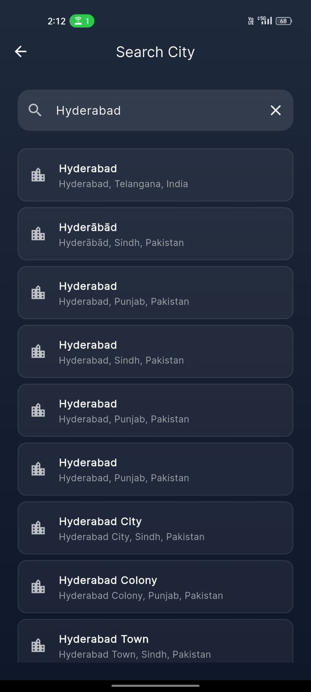

<h1 align="center">Aura Weather App 🌤️</h1>

<p align="center">
  A premium, beautifully designed cross-platform weather application built with Flutter. Features live autocomplete search, dynamic Lottie animations, GPS integration, and a glassmorphism UI.
</p>

<p align="center">
  
  
  
</p>

<p align="center">
  <a href="#features">Features</a> •
  <a href="#tech-stack">Tech Stack</a> •
  <a href="#screenshots">Screenshots</a> •
  <a href="#installation">Installation</a> •
  <a href="#live-demo">Live Demo</a>
</p>

---

## ✨ Features

* 🔍 **Live Autocomplete Search**: Instantly searches millions of global cities using the Open-Meteo Geocoding API, utilizing precise Lat/Lon coordinates for perfect accuracy.
* 📍 **GPS Location Integration**: Automatically detects your current physical location (with permission) on startup to instantly show local weather.
* 💾 **Persistent State**: Remembers your last searched location locally across app restarts so you never lose your place.
* 🎨 **Premium UI/UX**: Dark mode, glassmorphism container design, and smooth `Lottie` animations that dynamically change based on weather conditions.
* 📅 **7-Day Forecast**: Clean and accurate daily temperature and condition predictions.

## 🛠 Tech Stack

* **Framework**: [Flutter](https://flutter.dev/) (Dart)
* **State Management**: `provider`
* **API Integration**: `http` (RESTful calls to Open-Meteo API)
* **Local Storage**: `shared_preferences`
* **Hardware/Location**: `geolocator`
* **Animations**: `lottie`
* **Typography**: `google_fonts`

## 📸 Screenshots

<div align="center">
  <!-- TODO: Add your actual screenshots to the assets/screenshots/ folder! -->
  
  &nbsp;&nbsp;&nbsp;&nbsp;
  
</div>

## 🚀 Live Demo

[🌍 Click here to view the live Web Demo](https://your-live-demo-link.com) 
*(Note: Replace this link with your hosted Flutter Web URL, or remove this section if you only intend it for mobile)*

## 💻 Installation

Follow these steps to build and run the app locally:

1. **Clone the repository:**
   ```bash
   git clone https://github.com/yourusername/weather-app.git
   cd weather-app
   ```

2. **Install dependencies:**
   ```bash
   flutter pub get
   ```

3. **Run the app:**
   ```bash
   flutter run
   ```

## 📂 Architecture & Folder Structure

This project follows a clean separation of concerns:

```text
lib/
├── models/          # Robust data models for safe JSON parsing
│   ├── location_model.dart
│   └── weather_model.dart
├── providers/       # Centralized state management & business logic
│   └── weather_provider.dart
├── screens/         # Separated UI views
│   ├── home_screen.dart
│   └── search_screen.dart
├── services/        # API integration and asynchronous network calls
│   └── weather_api.dart
└── main.dart        # Entry point and theme configuration
```

## 📝 License

This project is open-source and available under the MIT License.
